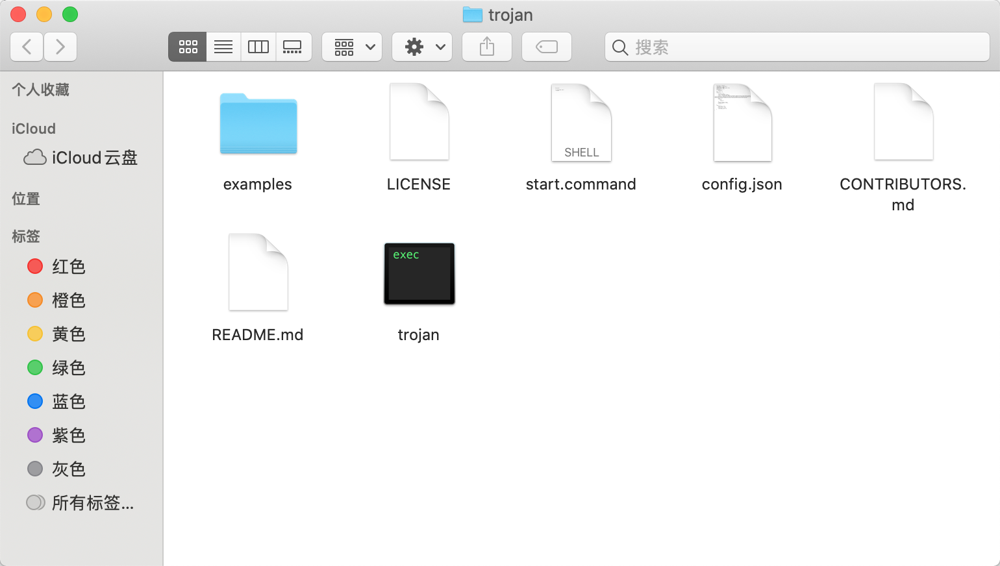

### 修改配置文件
- 先解压zip文件  

- 打开config.json文件，开头大致是这样的

···java
{
    "run_type": "client",
    "local_addr": "127.0.0.1",
    "local_port": 1080,
    "remote_addr": "example.com",
    "remote_port": 443,
    "password": [
        "password1"
    ]
}
···
