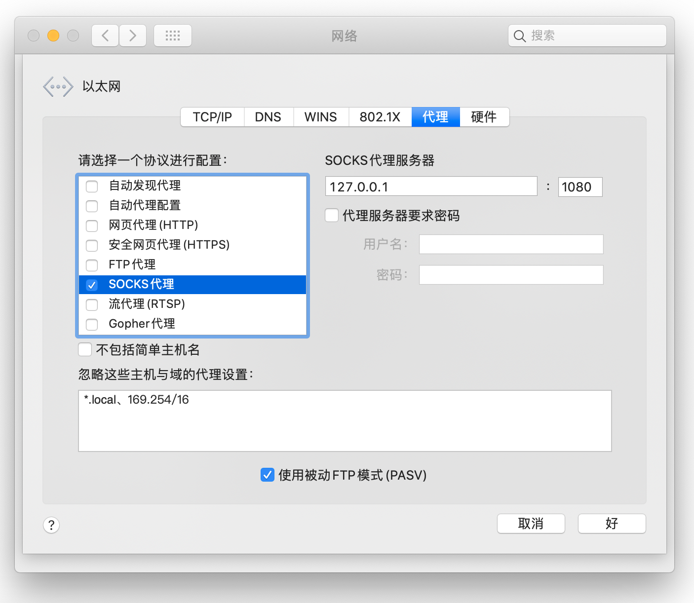

# 在Mac电脑上使用
### 修改配置文件
- 先解压zip文件  


- 打开config.json文件，开头大致是这样的

```java
{
    "run_type": "client",
    "local_addr": "127.0.0.1",
    "local_port": 1080,
    "remote_addr": "example.com",
    "remote_port": 443,
    "password": [
        "password1"
    ]
}
```
- 要改的只有两行：      
        
        "remote_addr": "example.com",
- 还有        

        "password1"
- example.com和password1分别替换成网址和密码可以了，引号和逗号都不能删        

### 更改系统设置  
- 系统偏好设置 -> 网络 -> [你正在使用的网络] 右下角的 高级 -> 代理


- 设置 SOCKS 代理服务为 127.0.0.1 端口为 1080 ，如下图



- 打开你的访达，在右上角菜单：访达--->服务--->服务偏好设置，勾选新建位于文件夹位置的终端窗口，如下图


- 然后在你解压出来的trojan文件夹的上一层，：右键trojan文件夹->服务->新建位于文件夹位置的终端窗口，如下图


- 把下面的代码复制到终端，按回车就可以跑起来了        
        
        ./trojan config.json


- 现在你可以出去玩了

#不用时请在终端按下Ctrl+C中断，并回到设置中取消勾选代理
