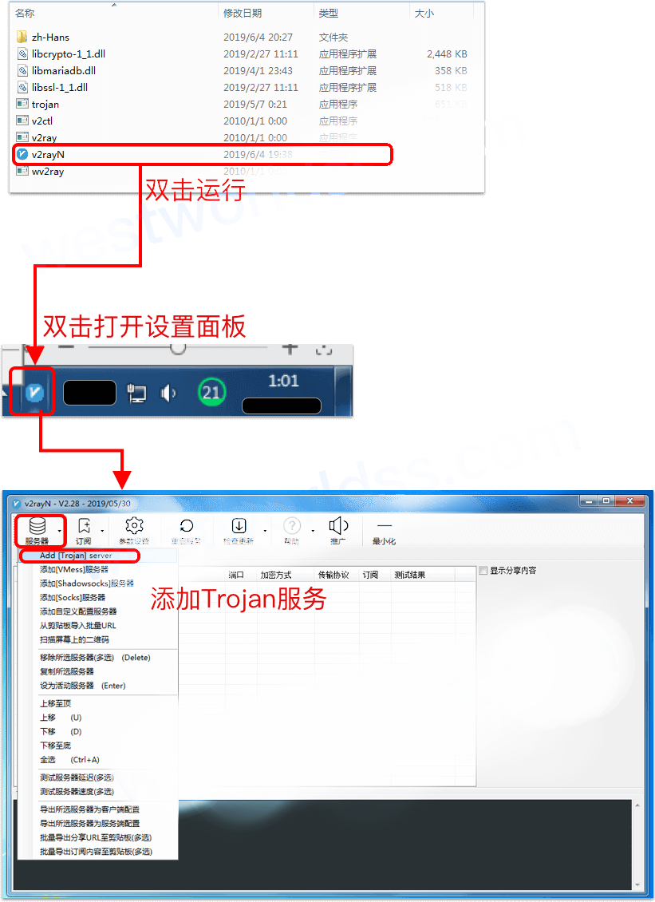
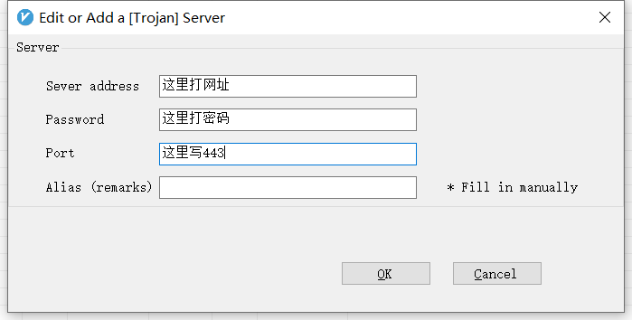
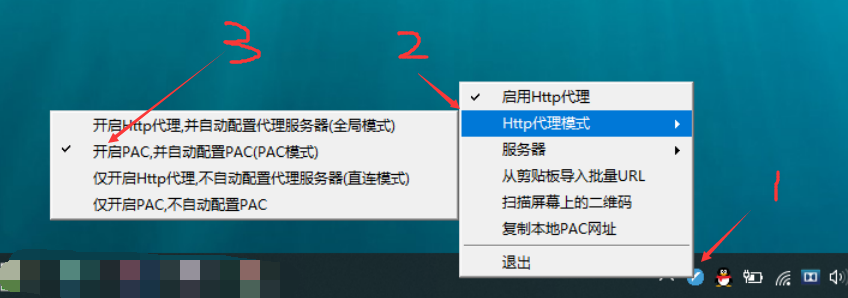

# 在Windows电脑上使用
- 解压压缩包  
- 直接打开v2rayN.exe,之后在任务栏右下角找到蓝V小图标
- 如果你打不开，请尝试安装以下依赖库
  - [Visual C++ 2015 (x64、x86均安装)](https://www.microsoft.com/zh-CN/download/details.aspx?id=48145)
  - [Windows.NET Framework 4.6.2](https://support.microsoft.com/zh-cn/help/3151800/the-net-framework-4-6-2-offline-installer-for-windows)
- 打开在左上角服务器中选择：add Trojan server

- 然后将信息填入输入框：

- 回到右下角蓝V，右键
- 点击启用HTTP代理
- 点击HTTP代理模式-选择全局模式

# 如无意外，你已经可以用了
